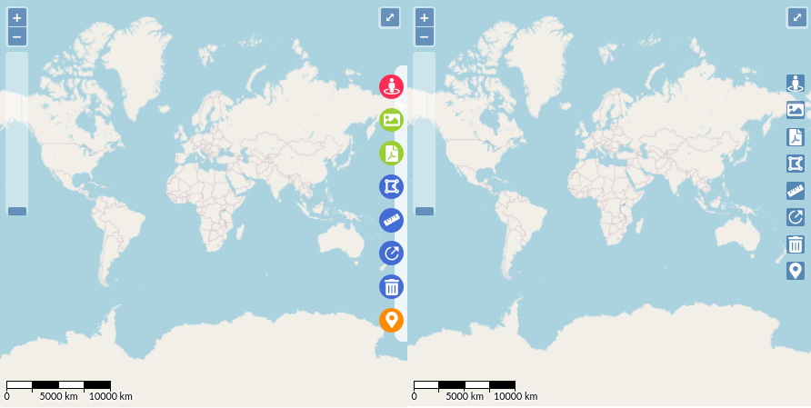

# react-openlayers-styled-map

> Openlayers map component wrapped in react component with style and global hooks

[](https://www.npmjs.com/package/react-openlayers-styled-map) [](https://www.typescriptlang.org/)


<a href="https://www.buymeacoffee.com/cassianorsd" target="_blank"></a>

This (react-openlayers-styled-map) is a React.JS component made in Typescript.
It acts as a wrapper around [OpenLayers](https://openlayers.org/) map object and tries to supress the complexity of a starting map project.

Currently, the lib has a simple global state hook that provides access from any part of a react project to the OL map object and some extra key functions.

Also, some usefull styled and ready-to-use map controls, some of them directly translated from OL Docs.

- Measure Polygon area
- Measure Distance
- Export map as image (uses [html2canvas](https://www.npmjs.com/package/html2canvas))
- Export map as PDF (uses [jsPDF](https://www.npmjs.com/package/jspdf))
- Draw Circle Radius
- Pin Coordinates
- Redirect to Google Street View from point

## Install

```bash
npm install --save react-openlayers-styled-map
//or
yarn add react-openlayers-styled-map

//ATTENTION
//react-openlayers-styled-map uses Openlayers (ol) package as peer dependency
npm install ol
yarn add ol
```

# Demo

In [react-openlayers-styled-map](https://cassianorsd.github.io/react-openlayers-styled-map/) is possible to test a working demo/project of the component and also a debug page to quick test some XYZ/WMS layer sources.

The page is also using routing from [react-router-dom](https://www.npmjs.com/package/react-router-dom) library to test the map component remounting capabilities and bugs.

## Usage

### Map Component

```tsx
import React, { Component } from 'react';

import { StyledMap, Controls } from 'react-openlayers-styled-map';

const Page = () => {
  return (
    <StyledMap
      id='map' // Optional, just in case of conflict with other components
      startCoordinates={[-49.2, -26.5]}
      startZoom={11}
      tileDebug // Enable tile debug overlay for testing
      osmBasemap //Enable OSM Background for quick testing
      defaultControls={{
        /*
                You can leave {} to enable the default props for each control
                See Openlayers Specific control documentation for custom properties
                */
        fullScreenMode: { tipLabel: 'Click to toggle' },
        zoomButtons: {},
        zoomSlider: {},
        scale: {
          bar: true,
          minWidth: 130,
          steps: 4,
        },
      }}
    >
      <StyledMap.Controls showRibbon>
        <Controls.GoogleStreetView styled activeLabel='custom label' />
        <Controls.ExportMapImage styled color='purple' />
        <Controls.ExportMapPDF styled />
        <Controls.MeasureArea styled />
        <Controls.MeasureDistance styled />
        <Controls.MeasureRadius styled />
        <Controls.ClearMeasures styled />
        <Controls.PinCoordinates styled />
      </StyledMap.Controls>
    </StyledMap>
  );
};
```

### Hooks / Methods Abstractions

#### Access map object

```tsx

import { useMap } from 'react-openlayers-styled-map'
const Sidebar = () => {
  const { map } = useMap();
  //map is the pure ol map object, so you can access all the power of the OpenLayers lib
  useEffect(()=>{
    map.addOverlay(...)
    map.addInteraction(...)
    map.addLayer(...)
    map.on('click',()=>{})
  },[])
  return <div>My Sidebar Component</div>
}
```

#### Abstractions that comes with the library

```tsx

import { useMap } from 'react-openlayers-styled-map'
const Component = () => {
  const = {
    getLayer,
    addLayer,
    removeLayer,
    setActiveMenuControl
    } = useMap();


  setActiveMenuControl('GoogleStreetView') // Remotely enable menu control
  setActiveMenuControl(undefined) // Disable all menu controls, this method triggers the onDisable method on the currently active control

  //addLayer method wraps around map.addLayer and register the objects in the activeLayers
  // for and easy to use access for custom management components Ex: like Layer Selectors or TreeViews
  addLayer({
    layerKey: 'layerUniqueName2',
    layerObject:new TileLayer({source: new OSM()})
    });
  console.log(getLayer('layerUniqueName2'))
  // {layerKey:'layerUniqueName2',layerObject:object}

  //remove layer from map
  removeLayer('layerUniqueName2')
}
```

## Custom Menu Control

You can create a new custom control just wrapping the default ControlButton component and point the enable/disable callbacks and a unique key.

```tsx
import React, { useCallback } from 'react';
import { Controls, useMap } from 'react-openlayers-styled-map';
import { FaCrosshairs } from 'react-icons/fa';
import { toLonLat } from 'ol/proj';
import { MapBrowserEvent } from 'ol';

const MyCustomControl: React.FC = () => {
  const { map } = useMap();

  const onMapClick = (e: MapBrowserEvent): void => {
    const coords = toLonLat(e.coordinate);
    alert(coords);
  };

  const onEnable = useCallback(() => {
    map.getViewport().style.cursor = 'crosshair';
    map.on('click', onMapClick);
  }, [map]);

  const onDisable = useCallback(() => {
    map.getViewport().style.cursor = '';
    map.un('click', onMapClick);
  }, [map]);

  return (
    <Controls.ControlButton
      styled
      icon={<FaCrosshairs size={20} color='#fff' />}
      activeLabel='Print Map Coordinates'
      color='#FE2C54'
      enable={onEnable}
      disable={onDisable}
      controlKey='PrintMapCoordinates'
    />
  );
};
```

Usage

```tsx
<StyledMap {...ANOTHER PROPS}>
    <StyledMap.Controls showRibbon >
      <MyCustomControl styled />
    </StyledMap.Controls>
</StyledMap>
```

### Styled and Default Styled

Each control component has a `styled` prop to enable the styled interface.



## License

MIT © [cassianorsd](https://github.com/cassianorsd)
